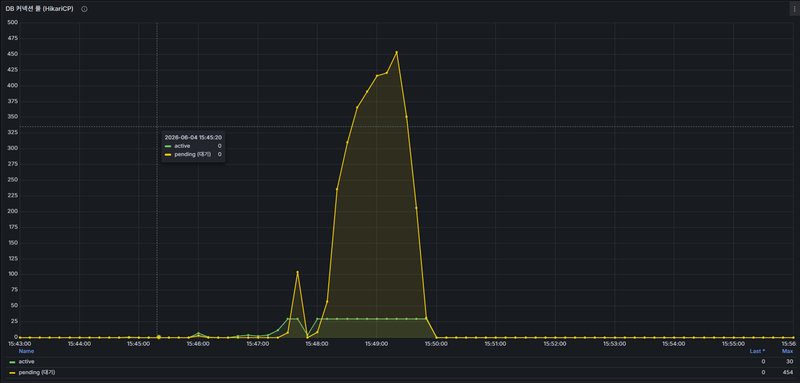
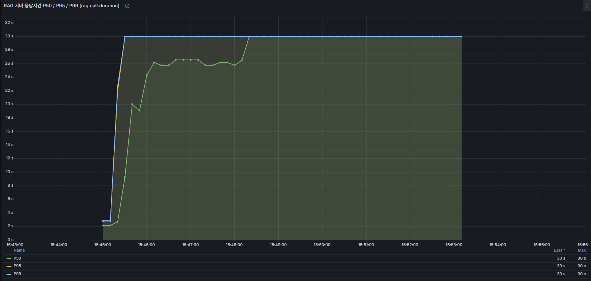
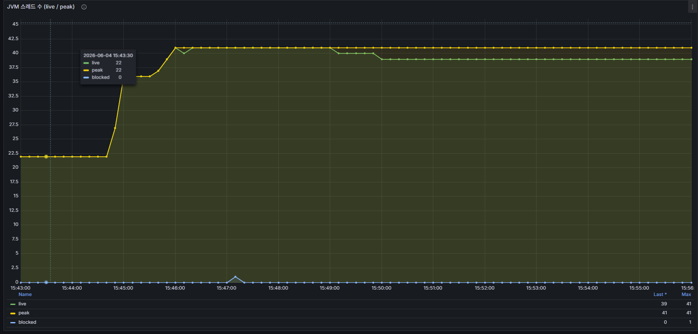
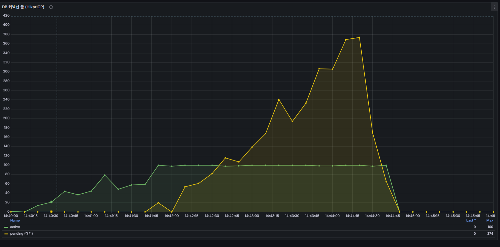
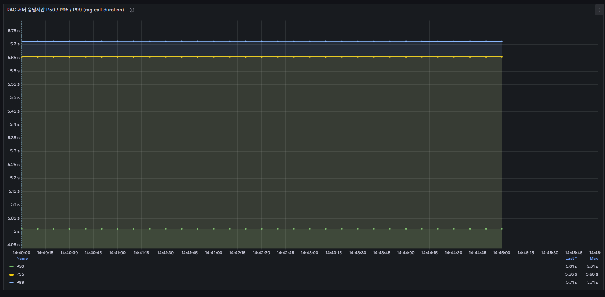

## 개요
k6 ramp-up 시나리오(최대 VU 300)에서 HTTP p95 응답시간이 2,756ms, 에러율이 10.6%로 측정됐다.
에러율 임계값(5%)을 초과해 테스트가 실패 판정을 받았다.
Tomcat 플랫폼 스레드가 VU 200 구간에서 포화되어 VU 300 초과 시 큐 적체와 요청 실패가 급증하는 것으로 추정된다.

## 발견 배경
Phase 2 부하 테스트 1회차 실행 중 발견됐다.
LLM 지연을 `MOCK_DELAY_SECONDS=5`(5초 고정)로 시뮬레이션한 조건이며,
Rate Limit은 `loadtest` 프로파일로 비활성화한 상태였다.

## 테스트 환경
- 시나리오: ramp-up (01-ramp.js)
- 최대 VU: 300명
- 테스트 시간: 약 5분 (30s + 1m×4 + 30s)
- 총 요청 수: 33,675건
- 평균 RPS: 109.8 req/s
- 에러율: 10.6% (임계값 5% 초과 → 테스트 실패)
- 기타 조건: MOCK_DELAY_SECONDS=5, Rate Limit 비활성화

## 상태 (Before)
- HTTP p95: **2,755.9ms**
- Query p95: **2,757.3ms**
- 에러율: **10.6%** (5% 임계값 초과)
- 총 요청: 33,675건 / 109.8 RPS





## 원인 분석
Grafana 메트릭으로 3가지 병목이 확인됐다.

**1. DB 커넥션 풀 고갈 (주요 원인)**
HikariCP active 커넥션이 최대 30개에서 포화되고, pending(대기) 커넥션이 최대 **454개**까지 적체됐다.
각 요청이 RAG 응답 5초를 기다리는 동안 DB 커넥션을 점유하여 커넥션 풀이 빠르게 소진됐다.

**2. RAG 서버 응답시간 상한 고착**
부하 시작 직후 P50 26초, P95/P99가 **30초 상한**에 고착됐다.
WebClient readTimeout 설정값(30초)에 도달한 것으로, RAG 서버가 처리를 따라가지 못해 타임아웃이 연속 발생했다.

**3. JVM 스레드 수**
live 22→41, peak **41**로 관찰됐다. ramp 시나리오가 가정한 Tomcat 스레드 포화 임계(200)보다 현저히 낮아,
실제 스레드풀 크기나 가상 스레드 활성 여부를 별도로 확인해야 한다.

**결론**: DB 커넥션 보유 중 외부 I/O 대기(RAG 5초 + 30초 타임아웃)가 커넥션 풀을 고갈시켜 에러를 유발했다.
RAG 호출 전 트랜잭션 종료 여부 재확인 필요.

## 적용한 변경
- `backend/src/main/resources/application.yaml`: HikariCP `maximum-pool-size` 30 → 100
  - 가상 스레드 환경에서 VU 300 동시 부하 시 `prepareSession()` + `@Async` 이벤트 핸들러가 경합하는 실제 DB 커넥션 수요에 맞게 상향
  - 기존 30개는 `connection-timeout: 3000ms` 초과 → `ConnectionTimeoutException` → 에러율 10.6% 유발

## 결과 (After)
| 지표 | Before (pool 30) | After (pool 100) |
|------|-----------------|-----------------|
| 에러율 | 10.6% | **0.05%** |
| RPS | 109.8 req/s | **237.3 req/s** |
| 총 처리량 | 33,675건 | **71,953건** |
| P95 응답시간 | 2,755ms | **1,192ms** |

- 에러율 **10.6% → 0.05%** (200배 개선)
- RPS **109.8 → 237.3** (2.16배 향상)
- P95 **2,755ms → 1,192ms** (57% 단축)
- DB pending: 454 → 374 (pool 100이 커넥션을 빠르게 회전시켜 3초 타임아웃 전에 대부분 처리)
- RAG P50/P95/P99: 26s/30s/30s → **5.01s/5.66s/5.71s** (타임아웃 고착 해소)




## 관련 파일 및 코드
- `k6/results/ramp-summary.json`
- `k6/scenarios/01-ramp.js:37-55`
- `backend/src/main/resources/application.yaml:17`

```json
{
  "scenario": "ramp-up",
  "metrics": {
    "http_req_duration_p95": 1192.07,
    "http_req_failed_rate": 0.0005,
    "http_reqs_total": 71953,
    "http_reqs_rate": 237.32,
    "query_duration_p95": 1192.40
  }
}
```

## 이력서 포인트
k6 ramp 테스트(300 VU, LLM 5초 지연)에서 에러율 10.6% 발생 → Grafana로 HikariCP pending 454 확인 → 가상 스레드 환경에서도 DB 커넥션 풀(30개)이 `prepareSession()` + `@Async` �핸들러 경합으로 고갈됨을 진단 → pool size 100으로 조정해 에러율 0.05%, RPS 237.3, P95 1,192ms 달성 (에러율 200배 개선, 처리량 2.16배 향상)
