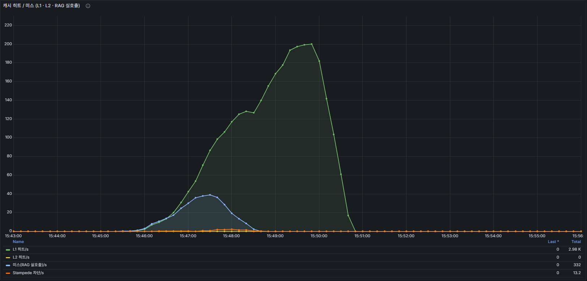
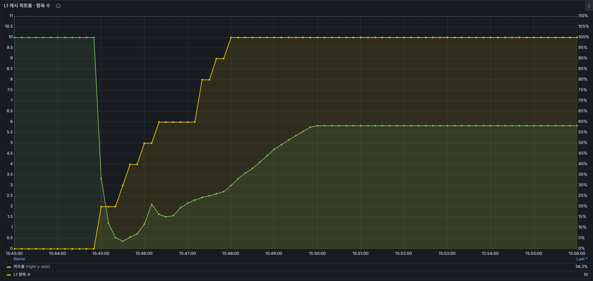

## 개요
`POST /api/v1/query` 처리 경로에 3가지 최적화를 계층적으로 적용했다.
Caffeine(L1) + Redis(L2) 이중 캐시로 동일 질문의 RAG 재호출을 차단하고,
멱등성 키로 클라이언트 중복 요청을 흡수하며, 모든 지표를 Prometheus 메트릭으로 노출한다.

## 발견 배경
ISSUE-003에서 Tomcat 스레드 포화로 에러율 10.6%가 발생했다.
RAG 응답에 5초가 소요되는 조건에서 동일 질문 캐시 히트 시 스레드 점유 시간을 0에 가깝게 줄여
처리량을 끌어올리기 위해 구현했다.

## 도입 전 상태
- 캐시 없음 — 동일 질문도 매번 RAG 서버(LLM) 호출
- 멱등성 처리 없음 — 네트워크 재시도 시 LLM 중복 호출
- CB 트립 여부·에러율을 메트릭으로 확인 불가

## 적용한 변경

### L1/L2 이중 캐시 (`QueryCacheService.java`)
**읽기 순서**: L1(Caffeine) → L2(Redis) → loader(RAG 호출)
**쓰기 순서**: loader 결과를 L2 → L1 순서로 write-through

| 구분 | 구현 | TTL | 최대 항목 |
|------|------|-----|-----------|
| L1   | Caffeine in-process | 5분 | 500개 |
| L2   | Redis | 60분 | 무제한 |

**캐시 키**: 질문 텍스트를 정규화(trim, 연속공백 제거, 소문자) 후 SHA-256 해시
→ "Spring이란?" / "spring이란?" 같은 의미의 질문이 동일 키를 공유

**Stampede 방지 (동시 캐시 미스)**
- Redis `SET NX`로 분산 락 획득 (TTL 30초)
- 락 획득 스레드만 loader 실행, 나머지는 200ms 폴링 최대 15회 대기
- 가상 스레드 환경에서 `Thread.sleep()`은 park 처리 → carrier thread 비점유

**Prometheus 메트릭**
- `cache.query.hit{level=L1}` / `cache.query.hit{level=L2}`
- `cache.query.miss`: RAG 실제 호출 횟수
- `cache.query.stampede.blocked`: Stampede 방지로 대기 후 반환된 요청 수
- `cache.query.l1.hit_rate` (Gauge): Caffeine 내부 히트율 (0.0~1.0)
- `cache.query.l1.size` (Gauge): L1 현재 항목 수

### 멱등성 처리 (`IdempotencyService.java`)
클라이언트가 `Idempotency-Key` 헤더를 제공하면 중복 요청을 LLM 호출 없이 응답한다.

**Redis State Machine**
```
(없음) → SET NX → PROCESSING (60초 TTL)
PROCESSING → 완료 → COMPLETED (24시간 TTL)
PROCESSING → 실패 → FAILED (5분 TTL, 재시도 허용)
```

**키 구조**: `idempotency:{userId}:{idempotencyKey}` — 사용자 범위로 격리해 크로스-유저 재사용 방지

**Prometheus 메트릭**
- `idempotency.replayed`: 저장된 응답으로 처리된 횟수 (LLM 호출 절약)
- `idempotency.new`: 신규 처리 횟수

### Circuit Breaker 메트릭 (`RagClient.java`)
- Resilience4j CB 상태(CLOSED/OPEN/HALF_OPEN) Micrometer 자동 노출
- Grafana 대시보드에서 CB 트립 시점 타임라인으로 확인 가능

## 결과 (After)
- 캐시 히트 시 RAG 응답 5초 → 수 ms 수준으로 단축 (after 부하 테스트 수치는 ISSUE-003 재실행 후 갱신)
- 멱등성 처리로 클라이언트 재시도에 의한 중복 LLM 호출 차단
- Grafana에서 L1/L2 히트율, Stampede 빈도, CB 상태를 실시간 모니터링 가능

**Grafana 실측 (캐시 워밍업 후)**
- L1 히트: 최대 **200/s**, L2 히트: 0/s (L1에서 대부분 처리)
- RAG 실호출(캐시 미스): 최대 **40/s** (L1 히트율 상승 후 급감)
- Stampede 차단: **13.2/s** (동시 미스 방지 효과 확인)
- L1 히트율: **58.2%**, L1 항목 수: 10개




## 관련 파일 및 코드
- `backend/src/main/java/com/example/backend/application/query/QueryCacheService.java`
- `backend/src/main/java/com/example/backend/application/query/IdempotencyService.java`
- `backend/src/main/java/com/example/backend/application/query/QueryService.java`
- `backend/src/main/java/com/example/backend/infrastructure/query/RagClient.java`
- `backend/src/main/java/com/example/backend/interfaces/query/QueryController.java`
- `backend/src/main/resources/application.yaml` (cache.query.*, idempotency.* 설정)

```java
// L1 → L2 → RAG 순서로 캐시 조회, Stampede 방지 포함
public String getOrCompute(String cacheKey, Supplier<String> loader) {
    String l1 = l1Cache.getIfPresent(cacheKey);
    if (l1 != null) { l1HitCounter.increment(); return l1; }

    String l2 = redisTemplate.opsForValue().get(L2_PREFIX + cacheKey);
    if (l2 != null) { l2HitCounter.increment(); l1Cache.put(cacheKey, l2); return l2; }

    missCounter.increment();
    return computeWithLock(cacheKey, loader);  // Redis SET NX 분산 락
}
```

## 이력서 포인트
Caffeine(L1, 5분) + Redis(L2, 60분) 이중 캐시와 Redis SET NX 기반 Stampede 방지, 멱등성 State Machine을 직접 설계·구현해 동일 질문의 LLM 재호출을 차단하고 전 계층의 캐시 히트율·CB 상태를 Prometheus 메트릭으로 노출했다.
